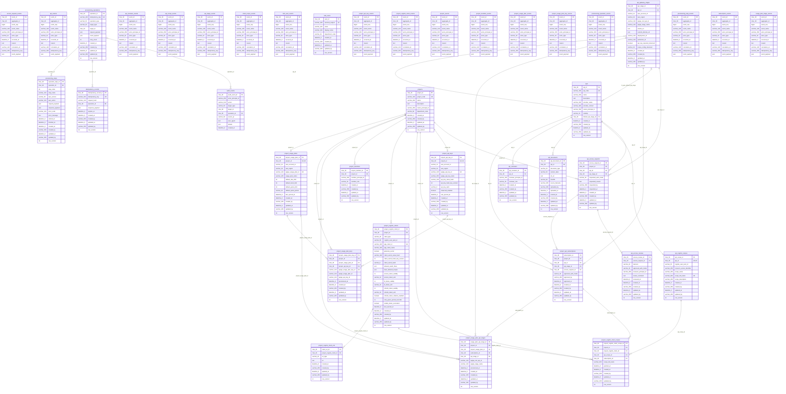

<!-- AUTO-GENERATED by src/tools/generate_db_er_diagram.py. DO NOT EDIT. -->

# ER図

正本DDL: `src/db/ddl.sql`

```mermaid
erDiagram
  access_request_events {
    char_36 event_id PK
    char_36 aggregate_id
    bigint event_seq
    varchar_128 event_name
    varchar_256 actor_principal_id
    varchar_32 actor_type
    datetime_6 occurred_at
    text reason
    varchar_128 correlation_id
    varchar_256 idempotency_key
    json event_payload
  }
  api_access_requests {
    char_36 access_request_id PK
    char_36 project_id FK
    char_36 api_id FK
    char_36 api_stage_id FK
    varchar_30 requested_auth_mode
    text requested_reason
    varchar_256 requested_by
    datetime_6 requested_at
    datetime_6 created_at
    varchar_256 created_by
    datetime_6 updated_at
    varchar_256 updated_by
    int row_version
  }
  api_access_reviews {
    char_36 access_review_id PK
    char_36 access_request_id FK
    varchar_20 decision
    varchar_30 approved_auth_mode
    varchar_256 reviewer_principal_id
    text review_comment
    datetime_6 reviewed_at
    datetime_6 created_at
    varchar_256 created_by
    datetime_6 updated_at
    varchar_256 updated_by
    int row_version
  }
  api_cognito_scopes {
    char_36 api_scope_id PK
    char_36 api_id UK, FK
    varchar_55 cognito_user_pool_id
    varchar_256 resource_server_identifier
    varchar_256 scope_name
    varchar_600 scope_full_name UK
    varchar_256 scope_description
    datetime_6 created_at
    varchar_256 created_by
    datetime_6 updated_at
    varchar_256 updated_by
    int row_version
  }
  api_documents {
    char_36 api_document_id PK
    char_36 api_id FK
    varchar_20 document_type
    varchar_50 version_label
    text s3_uri
    varchar_64 sha256
    varchar_255 source_filename
    varchar_256 uploaded_by
    datetime_6 uploaded_at
    datetime_6 created_at
    varchar_256 created_by
    datetime_6 updated_at
    varchar_256 updated_by
    int row_version
  }
  api_events {
    char_36 event_id PK
    char_36 aggregate_id
    bigint event_seq
    varchar_128 event_name
    varchar_256 actor_principal_id
    varchar_32 actor_type
    datetime_6 occurred_at
    text reason
    varchar_128 correlation_id
    varchar_256 idempotency_key
    json event_payload
  }
  api_gateway_stages {
    char_36 api_stage_id PK
    char_36 api_id FK
    varchar_12 aws_account_id
    varchar_32 aws_region
    varchar_128 apigw_rest_api_id
    varchar_128 apigw_stage_name
    text invoke_url
    text custom_domain_url
    varchar_128 deployment_id
    varchar_128 authorizer_id
    boolean api_key_required_observed
    varchar_30 scope_config_observed
    datetime_6 created_at
    varchar_256 created_by
    datetime_6 updated_at
    varchar_256 updated_by
    int row_version
  }
  api_reviewer_events {
    char_36 event_id PK
    char_36 aggregate_id
    bigint event_seq
    varchar_128 event_name
    varchar_256 actor_principal_id
    varchar_32 actor_type
    datetime_6 occurred_at
    text reason
    varchar_128 correlation_id
    varchar_256 idempotency_key
    json event_payload
  }
  api_reviewers {
    char_36 api_reviewer_id PK
    char_36 api_id FK
    varchar_256 reviewer_principal_id
    varchar_20 reviewer_role
    datetime_6 created_at
    varchar_256 created_by
    datetime_6 updated_at
    varchar_256 updated_by
    int row_version
  }
  api_scope_events {
    char_36 event_id PK
    char_36 aggregate_id
    bigint event_seq
    varchar_128 event_name
    varchar_256 actor_principal_id
    varchar_32 actor_type
    datetime_6 occurred_at
    text reason
    varchar_128 correlation_id
    varchar_256 idempotency_key
    json event_payload
  }
  api_stage_events {
    char_36 event_id PK
    char_36 aggregate_id
    bigint event_seq
    varchar_128 event_name
    varchar_256 actor_principal_id
    varchar_32 actor_type
    datetime_6 occurred_at
    text reason
    varchar_128 correlation_id
    varchar_256 idempotency_key
    json event_payload
  }
  apis {
    char_36 api_id PK
    varchar_100 api_code UK
    varchar_200 name
    text description
    varchar_200 provider_name
    varchar_320 provider_contact
    varchar_256 owner_principal_id
    varchar_20 visibility
    char_36 default_api_stage_id FK
    datetime_6 created_at
    varchar_256 created_by
    datetime_6 updated_at
    varchar_256 updated_by
    int row_version
  }
  audit_events {
    char_36 audit_event_id PK
    varchar_256 actor_principal_id
    varchar_100 action
    varchar_50 target_type
    char_36 target_id
    char_36 operation_id FK
    varchar_64 source_ip
    text user_agent
    json details
    datetime_6 created_at
  }
  client_scope_events {
    char_36 event_id PK
    char_36 aggregate_id
    bigint event_seq
    varchar_128 event_name
    varchar_256 actor_principal_id
    varchar_32 actor_type
    datetime_6 occurred_at
    text reason
    varchar_128 correlation_id
    varchar_256 idempotency_key
    json event_payload
  }
  hub_user_events {
    char_36 event_id PK
    char_36 aggregate_id
    bigint event_seq
    varchar_128 event_name
    varchar_256 actor_principal_id
    varchar_32 actor_type
    datetime_6 occurred_at
    text reason
    varchar_128 correlation_id
    varchar_256 idempotency_key
    json event_payload
  }
  hub_users {
    char_36 user_id PK
    varchar_256 external_subject UK
    varchar_320 email
    varchar_200 display_name
    varchar_64 department_code
    datetime_6 created_at
    varchar_256 created_by
    datetime_6 updated_at
    varchar_256 updated_by
    int row_version
  }
  idempotency_records {
    char_36 idempotency_record_id PK
    varchar_200 idempotency_key UK
    varchar_128 request_hash
    char_36 operation_id FK
    json response_payload
    datetime_6 expires_at
    datetime_6 created_at
    varchar_256 created_by
    datetime_6 updated_at
    varchar_256 updated_by
    int row_version
  }
  project_api_key_events {
    char_36 event_id PK
    char_36 aggregate_id
    bigint event_seq
    varchar_128 event_name
    varchar_256 actor_principal_id
    varchar_32 actor_type
    datetime_6 occurred_at
    text reason
    varchar_128 correlation_id
    varchar_256 idempotency_key
    json event_payload
  }
  project_api_keys {
    char_36 project_api_key_id PK
    char_36 project_id UK, FK
    varchar_12 aws_account_id
    varchar_32 aws_region
    varchar_128 apigw_api_key_id UK
    varchar_255 apigw_api_key_name
    varchar_128 api_key_value_hash
    int api_key_hash_key_version
    varchar_8 api_key_last4
    boolean observed_enabled
    datetime_6 last_synced_at
    datetime_6 created_at
    varchar_256 created_by
    datetime_6 updated_at
    varchar_256 updated_by
    int row_version
  }
  project_api_subscriptions {
    char_36 subscription_id PK
    char_36 project_id FK
    char_36 api_id FK
    char_36 api_stage_id FK
    char_36 access_request_id FK
    varchar_30 approved_auth_mode
    varchar_256 approved_by
    datetime_6 approved_at
    datetime_6 created_at
    varchar_256 created_by
    datetime_6 updated_at
    varchar_256 updated_by
    int row_version
  }
  project_cognito_client_events {
    char_36 event_id PK
    char_36 aggregate_id
    bigint event_seq
    varchar_128 event_name
    varchar_256 actor_principal_id
    varchar_32 actor_type
    datetime_6 occurred_at
    text reason
    varchar_128 correlation_id
    varchar_256 idempotency_key
    json event_payload
  }
  project_cognito_client_scopes {
    char_36 project_cognito_client_scope_id PK
    char_36 project_id FK
    char_36 project_cognito_client_id FK
    char_36 api_scope_id FK
    char_36 subscription_id FK
    varchar_600 scope_full_name
    datetime_6 granted_at
    datetime_6 created_at
    varchar_256 created_by
    datetime_6 updated_at
    varchar_256 updated_by
    int row_version
  }
  project_cognito_client_urls {
    char_36 client_url_id PK
    char_36 project_cognito_client_id FK
    varchar_20 url_type
    text url
    datetime_6 created_at
    varchar_256 created_by
    datetime_6 updated_at
    varchar_256 updated_by
    int row_version
  }
  project_cognito_clients {
    char_36 project_cognito_client_id PK
    char_36 project_id FK
    varchar_40 client_type
    varchar_55 cognito_user_pool_id
    varchar_128 app_client_id UK
    varchar_128 app_client_name
    boolean generate_secret
    varchar_128 client_secret_value_hash
    int client_secret_hash_key_version
    varchar_8 client_secret_last4
    json allowed_oauth_flows
    json base_allowed_scopes
    int access_token_validity
    varchar_10 access_token_unit
    int id_token_validity
    varchar_10 id_token_unit
    int refresh_token_validity
    varchar_10 refresh_token_unit
    boolean refresh_token_rotation_enabled
    int retry_grace_period_seconds
    boolean enable_token_revocation
    datetime_6 last_synced_at
    datetime_6 created_at
    varchar_256 created_by
    datetime_6 updated_at
    varchar_256 updated_by
    int row_version
  }
  project_events {
    char_36 event_id PK
    char_36 aggregate_id
    bigint event_seq
    varchar_128 event_name
    varchar_256 actor_principal_id
    varchar_32 actor_type
    datetime_6 occurred_at
    text reason
    varchar_128 correlation_id
    varchar_256 idempotency_key
    json event_payload
  }
  project_member_events {
    char_36 event_id PK
    char_36 aggregate_id
    bigint event_seq
    varchar_128 event_name
    varchar_256 actor_principal_id
    varchar_32 actor_type
    datetime_6 occurred_at
    text reason
    varchar_128 correlation_id
    varchar_256 idempotency_key
    json event_payload
  }
  project_members {
    char_36 project_member_id PK
    char_36 project_id FK
    varchar_256 member_principal_id
    varchar_20 member_role
    datetime_6 created_at
    varchar_256 created_by
    datetime_6 updated_at
    varchar_256 updated_by
    int row_version
  }
  project_usage_plan_api_stages {
    char_36 usage_plan_api_stage_id PK
    char_36 project_id FK
    char_36 project_usage_plan_id FK
    char_36 subscription_id FK
    char_36 api_stage_id FK
    varchar_128 apigw_rest_api_id
    varchar_128 apigw_stage_name
    datetime_6 provisioned_at
    datetime_6 created_at
    varchar_256 created_by
    datetime_6 updated_at
    varchar_256 updated_by
    int row_version
  }
  project_usage_plan_events {
    char_36 event_id PK
    char_36 aggregate_id
    bigint event_seq
    varchar_128 event_name
    varchar_256 actor_principal_id
    varchar_32 actor_type
    datetime_6 occurred_at
    text reason
    varchar_128 correlation_id
    varchar_256 idempotency_key
    json event_payload
  }
  project_usage_plan_key_events {
    char_36 event_id PK
    char_36 aggregate_id
    bigint event_seq
    varchar_128 event_name
    varchar_256 actor_principal_id
    varchar_32 actor_type
    datetime_6 occurred_at
    text reason
    varchar_128 correlation_id
    varchar_256 idempotency_key
    json event_payload
  }
  project_usage_plan_keys {
    char_36 project_usage_plan_key_id PK
    char_36 project_id FK
    char_36 project_usage_plan_id FK
    char_36 project_api_key_id FK
    varchar_128 apigw_usage_plan_key_id UK
    varchar_128 apigw_usage_plan_id
    varchar_128 apigw_api_key_id
    datetime_6 provisioned_at
    datetime_6 created_at
    varchar_256 created_by
    datetime_6 updated_at
    varchar_256 updated_by
    int row_version
  }
  project_usage_plans {
    char_36 project_usage_plan_id PK
    char_36 project_id UK, FK
    varchar_12 aws_account_id
    varchar_32 aws_region
    varchar_128 apigw_usage_plan_id UK
    varchar_255 usage_plan_name
    int default_rate_limit
    int default_burst_limit
    int default_quota_limit
    varchar_10 default_quota_period
    datetime_6 last_synced_at
    datetime_6 created_at
    varchar_256 created_by
    datetime_6 updated_at
    varchar_256 updated_by
    int row_version
  }
  projects {
    char_36 project_id PK
    varchar_100 project_code UK
    varchar_200 name
    text description
    varchar_256 owner_principal_id
    varchar_64 department_code
    datetime_6 created_at
    varchar_256 created_by
    datetime_6 updated_at
    varchar_256 updated_by
    int row_version
  }
  provisioning_operation_events {
    char_36 event_id PK
    char_36 aggregate_id
    bigint event_seq
    varchar_128 event_name
    varchar_256 actor_principal_id
    varchar_32 actor_type
    datetime_6 occurred_at
    text reason
    varchar_128 correlation_id
    varchar_256 idempotency_key
    json event_payload
  }
  provisioning_operations {
    char_36 operation_id PK
    varchar_200 idempotency_key UK
    varchar_50 operation_type
    varchar_50 target_type
    char_36 target_id
    json request_payload
    json result_payload
    int retry_count
    datetime_6 created_at
    varchar_256 created_by
    datetime_6 updated_at
    varchar_256 updated_by
    int row_version
  }
  provisioning_step_events {
    char_36 event_id PK
    char_36 aggregate_id
    bigint event_seq
    varchar_128 event_name
    varchar_256 actor_principal_id
    varchar_32 actor_type
    datetime_6 occurred_at
    text reason
    varchar_128 correlation_id
    varchar_256 idempotency_key
    json event_payload
  }
  provisioning_steps {
    char_36 operation_step_id PK
    char_36 operation_id FK
    int step_order
    varchar_100 step_name
    varchar_50 aws_service
    varchar_100 aws_action
    json request_payload
    json response_payload
    varchar_100 error_code
    text error_message
    datetime_6 started_at
    datetime_6 finished_at
    datetime_6 created_at
    varchar_256 created_by
    datetime_6 updated_at
    varchar_256 updated_by
    int row_version
  }
  subscription_events {
    char_36 event_id PK
    char_36 aggregate_id
    bigint event_seq
    varchar_128 event_name
    varchar_256 actor_principal_id
    varchar_32 actor_type
    datetime_6 occurred_at
    text reason
    varchar_128 correlation_id
    varchar_256 idempotency_key
    json event_payload
  }
  usage_plan_stage_events {
    char_36 event_id PK
    char_36 aggregate_id
    bigint event_seq
    varchar_128 event_name
    varchar_256 actor_principal_id
    varchar_32 actor_type
    datetime_6 occurred_at
    text reason
    varchar_128 correlation_id
    varchar_256 idempotency_key
    json event_payload
  }
  api_access_requests ||--o{ api_access_reviews : access_request_id
  api_access_requests ||--o{ project_api_subscriptions : access_request_id
  api_cognito_scopes ||--o{ project_cognito_client_scopes : api_scope_id
  api_gateway_stages ||--o{ api_access_requests : api_stage_id
  api_gateway_stages o|--o{ apis : fk_apis_default_api_stage
  api_gateway_stages ||--o{ project_api_subscriptions : api_stage_id
  api_gateway_stages ||--o{ project_usage_plan_api_stages : api_stage_id
  apis ||--o{ api_access_requests : api_id
  apis ||--o| api_cognito_scopes : api_id
  apis ||--o{ api_documents : api_id
  apis ||--o{ api_gateway_stages : api_id
  apis ||--o{ api_reviewers : api_id
  apis ||--o{ project_api_subscriptions : api_id
  project_api_keys ||--o{ project_usage_plan_keys : project_api_key_id
  project_api_subscriptions ||--o{ project_cognito_client_scopes : subscription_id
  project_api_subscriptions ||--o{ project_usage_plan_api_stages : subscription_id
  project_cognito_clients ||--o{ project_cognito_client_scopes : project_cognito_client_id
  project_cognito_clients ||--o{ project_cognito_client_urls : project_cognito_client_id
  project_usage_plans ||--o{ project_usage_plan_api_stages : project_usage_plan_id
  project_usage_plans ||--o{ project_usage_plan_keys : project_usage_plan_id
  projects ||--o{ api_access_requests : project_id
  projects ||--o| project_api_keys : project_id
  projects ||--o{ project_api_subscriptions : project_id
  projects ||--o{ project_cognito_client_scopes : project_id
  projects ||--o{ project_cognito_clients : project_id
  projects ||--o{ project_members : project_id
  projects ||--o{ project_usage_plan_api_stages : project_id
  projects ||--o{ project_usage_plan_keys : project_id
  projects ||--o| project_usage_plans : project_id
  provisioning_operations o|--o{ audit_events : operation_id
  provisioning_operations o|--o{ idempotency_records : operation_id
  provisioning_operations ||--o{ provisioning_steps : operation_id
```
