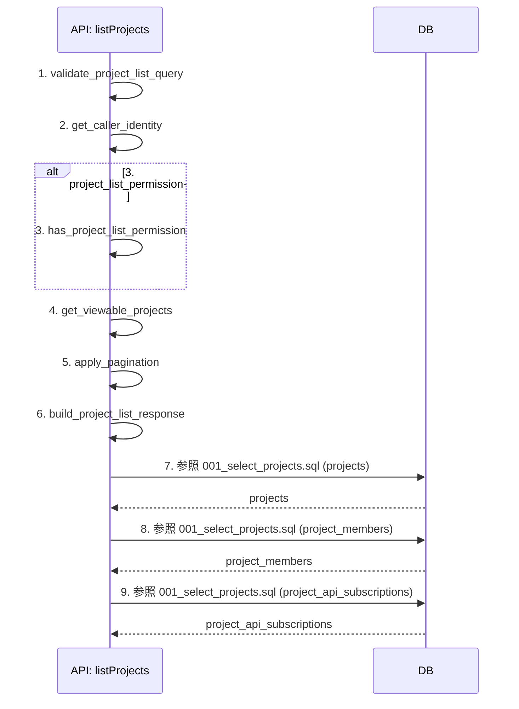

<!-- This file is generated by uv run python -m tools.generate_api_sequences. Do not edit manually. -->

# list_projects sequence

```mermaid
sequenceDiagram
  participant API as API: listProjects
  participant DB as DB
  API->>API: 1. validate_project_list_query
  API->>API: 2. get_caller_identity
  alt 3. project_list_permission
    API->>API: 3. has_project_list_permission
  end
  API->>API: 4. get_viewable_projects
  API->>API: 5. apply_pagination
  API->>API: 6. build_project_list_response
  API->>DB: 7. 参照 001_select_projects.sql (projects)
  DB-->>API: projects
  API->>DB: 8. 参照 001_select_projects.sql (project_members)
  DB-->>API: project_members
  API->>DB: 9. 参照 001_select_projects.sql (project_api_subscriptions)
  DB-->>API: project_api_subscriptions
```
