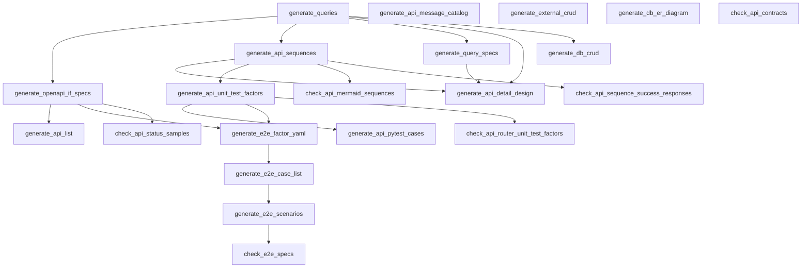

<!-- This file is generated by uv run app-docs generate-tools. Do not edit manually. -->

# Tools execution flow

```mermaid
flowchart TD
  generate_queries[generate_queries]
  generate_api_pytest_cases[generate_api_pytest_cases]
  generate_api_unit_test_factors --> generate_api_pytest_cases
  generate_openapi_if_specs[generate_openapi_if_specs]
  generate_queries --> generate_openapi_if_specs
  generate_api_list[generate_api_list]
  generate_openapi_if_specs --> generate_api_list
  generate_api_sequences[generate_api_sequences]
  generate_queries --> generate_api_sequences
  generate_query_specs[generate_query_specs]
  generate_queries --> generate_query_specs
  generate_api_detail_design[generate_api_detail_design]
  generate_queries --> generate_api_detail_design
  generate_query_specs --> generate_api_detail_design
  generate_api_sequences --> generate_api_detail_design
  generate_api_unit_test_factors[generate_api_unit_test_factors]
  generate_api_sequences --> generate_api_unit_test_factors
  generate_api_message_catalog[generate_api_message_catalog]
  generate_e2e_factor_yaml[generate_e2e_factor_yaml]
  generate_api_unit_test_factors --> generate_e2e_factor_yaml
  generate_openapi_if_specs --> generate_e2e_factor_yaml
  generate_e2e_case_list[generate_e2e_case_list]
  generate_e2e_factor_yaml --> generate_e2e_case_list
  generate_e2e_scenarios[generate_e2e_scenarios]
  generate_e2e_case_list --> generate_e2e_scenarios
  generate_db_crud[generate_db_crud]
  generate_queries --> generate_db_crud
  generate_external_crud[generate_external_crud]
  generate_db_er_diagram[generate_db_er_diagram]
  check_api_status_samples[check_api_status_samples]
  generate_openapi_if_specs --> check_api_status_samples
  check_api_contracts[check_api_contracts]
  check_api_mermaid_sequences[check_api_mermaid_sequences]
  generate_api_sequences --> check_api_mermaid_sequences
  check_api_sequence_success_responses[check_api_sequence_success_responses]
  generate_api_sequences --> check_api_sequence_success_responses
  check_api_router_unit_test_factors[check_api_router_unit_test_factors]
  generate_api_unit_test_factors --> check_api_router_unit_test_factors
  check_e2e_specs[check_e2e_specs]
  generate_e2e_scenarios --> check_e2e_specs
```
